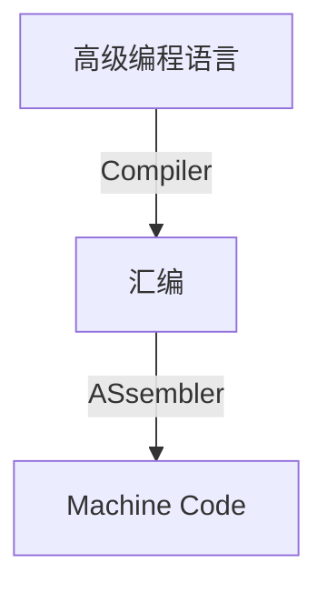

# Computer Abstraction

!!! info "info"
	这一章是总览性质的，没有特别的知识点，很多都是性质、概述。
	要注意**Time的计算**

- **Instruction set architecture（ISA,指令集系统结构）** ---- the interface between hardware and lowest-level software

## 组成

Graph From https://xuan-insr.github.io/

**SoftWare**

## I/O Interface

## Memory

## 语言转换

## * Time的计算

> 处理器执行时间由处理频率， 程序执行的指令数目和每条指令的性能决定； 而每条指令的性能，由每条指令所需时钟数决定

**Response time/execution time**     响应时间/执行时间

- How long it takes to do a task   

**Throughput (bandwidth)**  吞吐率

- Total work done per unit time
  - e.g., tasks/transactions/… per hour

??? example "了解cost"
	

**Performance = 1/Execution Time**

> **一个指令周期，包含多个 CPU 周期，而一个 CPU 周期包含多个时钟周期。**

> example
>
> 

- **CPI** : 每条指令的平均**周期**数(Average cycles per instruction)  --> CPU 周期

> example
>
> 

> example
>
> 

- **MIPS: Millions of Instructions Per Second**

## **Eight Great Ideas**

- Design for Moore’s Law  （设计紧跟摩尔定律） 

- Use Abstraction to Simplify Design (  采用抽象简化设计  ) 

- Make the Common Case Fast (  加速大概率事件  ) 

- Performance via **Parallelism**   (  通过并行提高性能  ) 

- Performance via **Pipelining** (  通过流水线提高性能  ) 

- Performance via Prediction (  通过预测提高性能  ) 

- Hierarchy of Memories (  存储器层次  ) 

- Dependability via Redundancy ( 通过冗余提高可靠性) 

## 题目

### Eight Idea

