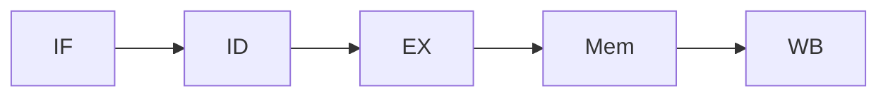
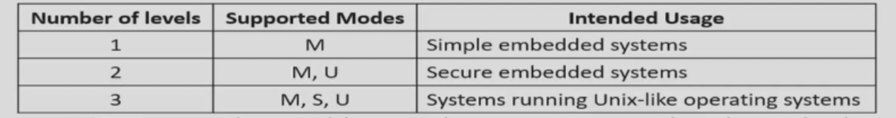
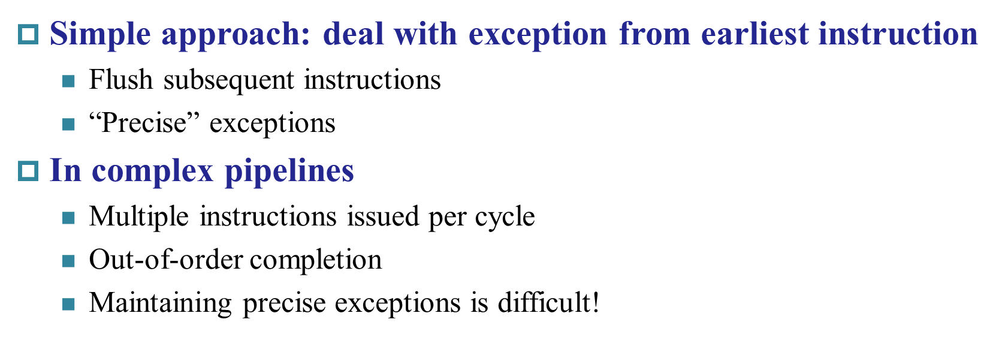

# Chapter 4 | Processor

## Part 1 Data Path

## Part 2 流水线

- a pipline in which one instruction is in each stage
- **CPI is decreased to 1, since one instruction will be issued (or finished) each cycle.** 

### 竞争 | Hazards

> 导致下一条指令无法正常进行的

#### 结构竞争 | Structure

> A **required resource is busy**

- **In RISC-V pipeline with a single memory**
  - Load/store requires data access
  - Instruction fetch would have to *stall* for that cycle
    - Would cause a pipeline “bubble”

- 把指令和数据分开存储

#### 数据竞争 | Data

> Need to wait for previous instruction to complete its data read/write

前一个的结果是后一个的操作数

- WB在下降沿触发
- ID在上升沿触发
- 插入"Bubble"进行"缓冲"

**Solution**

- **Forwarding (aka Bypassing)**

- `ld`指令

- **编译器方面**

  

#### 控制竞争 | Control

> Deciding on control action depends on previous instruction

- 例如，对`beq`，`IF`需要得知要去的地址，会把计算提前到`ID`步骤

##### Prediction

- Can predict branches not taken
- Fetch instruction after branch, with no delay

### RISC-V Pipelined Datapath

#### Form

#### Control 指令

- `WB`步骤的`Write Register`传回寄存器堆

### Data hazards

> **Consider this sequence:**
>
> sub x2, x1,x3
> and x12,x2,x5
> or  x13,x6,x2
> add x14,x2,x2
> sd  x15,100(x2)

- `ID/EX`那里要使用的`RS`是其他流水线的`RD`, 就出现了数据竞争（这里的定义有些笼统，更准确地还要加上条件：需要用到`RS`）

- 注意寄存器的写法，`ID/EX.RegisterRd `

$$
1.\ EX/MEM.RegisterRd=ID/EX.RegisterRs\\
2.\ EX/MEM.RegisterRd\ !=0 \\
3.\ EX/MEM.RegWrite==1
\\ 对于MEM/WB级同理
\\ \text{需要确保发生数据竞争的上一级的Rd是要写回的，且写回的寄存器不是}X_0
$$

#### **Double Data Hazard**

> 考虑两个地方都触发了数据竞争
>
> add x1,x1,x2
> add x1,x1,x3
> add x1,x1,x4

需要对`Mem/WB`级的特判

`EX/MEM`

`EX/MEM.RegWrite and (EX/MEM.RegisterRd!=0) and EX/MEM.RegisterRd = ID/EX.RegisterRs1`

`MEM/WB`

#### **Load-Use Hazard Detection**

- Load的时候，在`IF/ID`步骤需要判断，因为

- `ld`的结果在`EX/Mem`阶段才能得到

Bubble：空挡

### Branch hazard | Control

- 

### Exceptions and Interrupts | 异常与中断

!!! note "Interrupts"
	改变CPU的 work flow 的两种形式

	**predictable** 比如beq、bne等命令发生跳转
	
	**unpredictable**  出现异常

> 很多时候二者不加区分, 广义的Exception包括Interrupt

遇到异常需要处理两件事：
- 在哪里处理异常，如何跳过去
- 如何回去

??? note "Privilege"
    > 了解
    > 可以看马德老师智云
    
    - 模式
    
    
      
    
    
    - 与模式相关
        - 用户模式(User Mode)
        - 机器模式(Machine Mode)
        - 监督模式(Supervisor Mode)
    - 原子操作
    - 一共4096个CSR寄存器
    
    **Instruction**
    
    

- 异常控制程序

#### Multiple

- `precise` 按照异常的先后实现
- `imprecise` 
    - Let the handler work out

