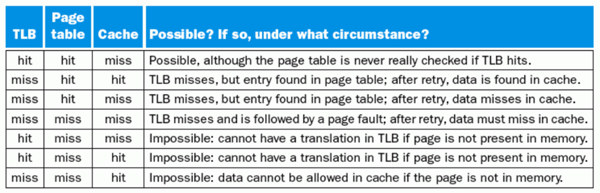

# 	Speed and Size

处理器速度  <= 高度相关 =>  寄存器速度

## Memory Technology

### **SRAM**
- value is stored  on a pair of **inverting gates** 两个反相器
- very fast but takes up more space than DRAM 

### **DRAM**
- Value is stored as a charge on **capacitor 电容器**
- Very small but slower than SRAM (factor of 5 to 10)
- Must periodically be refreshed 必须定期刷新
- Read contents and write back (destructive read) 破坏性读取

Bits in a DRAM are organized as a rectangular array

DRAM accesses an entire row

**Burst mode:** supply successive words from a row with reduced latency (SDRAM)

从一行中连续读取比较快

[数字逻辑](https://note.hobbitqia.cc/Logic/logic07/#dynamic-ram-dram)

!!! quote ""
    高速的口一般是串行的，接口很少  <== 保证多条线同时到达目标

### **Flash**

**Nonvolatile semiconductor storage 非易失半导体**

只能从1写到0，擦除代价大

- **NOR flash: bit cell like a NOR gate**
    - **Random read/write access**
    - Used for instruction memory in embedded systems
- **NAND flash: bit cell like a NAND gate**
    - **Denser (bits/area), but block-at-a-time access**
    - Cheaper per GB
    - Used for USB keys, media storage, …
- Flash bits wears out after 1000’s of accesses
    - Not suitable for direct RAM or disk replacement
    - Wear leveling: remap data to less used blocks

### **Disk**

**访问时间的计算：**

- 每次读取一个sector扇区的数据

## Memory Hierarchy Introduction

**locality**

- Temporal locality  时间局部性
    - **Items accessed recently** are likely to be accessed again soon
    - e.g., instructions in a loop, induction variables
- Spatial locality   空间局部性
    - Items **near those accessed recently** are likely to be accessed soon
    - E.g., sequential instruction access, array data

- Copy recently accessed (and nearby) items **from disk to smaller DRAM memory**
Main memory  主存

- Copy more recently accessed (and nearby) items **from DRAM to smaller SRAM memory**
Cache memory attached to CPU  缓冲

​	**cache 在CPU内部**

**概念**

- `Block` : unit of copying 搬运的最小单位 可能是一个word或者多个word

- `Hit` : If accessed data is present in upper level
    两层：从硬盘到内存，从内存到cache

    - `Hit Time` : The time to **access the upper level** of the memory hierarchy, which includes the time needed to **determine whether the access is a hit** or a miss.

    - `Hit ratio`: hits/accesses

- `Miss` : block copied from lower level
    - `Miss ratio` : misses/accesses = 1 – hit ratio
    - `Miss penalty` :         The time to **replace a block in the upper level** with the corresponding block from the lower level, plus the time to **deliver this block to the processor.** 把数据从底层拿到高层，之后再传给processor

## The basic of Cache

> SRAM and DRAM (main memory) 

### Direct mapped

**(Block address) modulo (Number of blocks in the cache)**

固定的位置  $\text{(Block address) \% (Number of blocks in the cache)} $

**Tag**  区分存放的哪个数据

- Store **block address** as well as the data
- Actually, only need the **high-order bits**

**Valid Bits**  这个Block是否为空

Valid bit: 1 = present, 0 = not present  最初设置为0

**Cache Block Address**

??? example "example"
    

!!! note "理解cache中的各个位"
    
    上面的部分是 Memory address（Tag + Index)，下面的才是cache中的(这里Cache Address就是它的索引Index)。这里每一个Block有四个word，需要两位来定位word，每个word有四个字节，需要两位来定位byte，故而`Byte offset = 4`

    `index` 在cache中寻找block，其大小由cache size决定
    
    `Offset` 用于去在data中寻址。注意寻址方式，一般是字节寻址，==但是很多题目会是word寻址，同时也看清楚给的地址是以字节址还是Word==。比如，一个 4-word blocks，就需要 index 先去寻找block，再由offset分别确定word和byte，故需要4bit
    
    一个cache slot实际的size是 data size of a block + Tag + Valid，但是提及某个cache大小时，都是只计算Data部分
    
    `Tag` 由 memory address 减去 Index、Byte Offset计算
    
    `Total cache size`: Block num(2^n) * (data size + tag size + valid bit)

**计算**

cache的命名不考虑标签和有效位的大小，只考虑数据的大小

??? example "example"
    
    

**Handling Cache reads hit and Misses**

- `Read`

    - Read Miss  暂停处理器，直到从内存中返回数据
        - **instruction cache miss**

        - **data cache miss**

??? info "detail"
	**1.** Send the original PC value (current PC-4) to the memory.

     **2.** Instruct main memory to perform a read and wait for the memory to complete its access. (in multiple cycles)
    
     **3.** Write the cache entry, putting the data from memory in the data portion of the entry, writing the upper bits of the address (from the ALU) into the tag field, and turning the valid bit on.
    
     **4.** Restart the instruction execution at the first step, which will refetch the instruction again, this time finding it in the cache.

- `Write hits`  不同的写策略  详细内容见后
    - **write-back: Cause Inconsistent** 
    Wrote the data into only the data cache
    
    - **write-through: Ensuring Consistent**
    
- `Write Miss`

    - 

### Deep Concept

!!! info "引入"
    

1-word block

#### Block Placement

##### Fully Associative 

Block can go anywhere in cache

##### Set Associative

Block can go in **one of a set of places** in the cache. 

**A set** is a group of blocks in the cache.

Block address MOD Number of sets in the cache   也就是针对上面的index在这里会是set index

If sets have n blocks, the cache is said to be **n-way set associative.**  注意这里是一个组有n个Block则称之为N-way set而非 n 个set

#### Block identification

基本相同

#### Block replacement

- `Random replacement` - randomly pick any block

- `Least-recently used (LRU)` 
	- pick the block in the set which was least recently accessed

Assumed more recently accessed blocks more likely to be referenced again

**This requires extra bits in the cache to keep track of accesses.**

- `First in,first out(FIFO)`
    - Choose a block from the set which was first came into the cache

#### Write Strategy

 **write hit** 

- **If the data are written to memory**, the cache is called a **write-through cache**
    - Can always discard cached data - most up-to-date data is in memory 在Disk中总是最新的数据
    - Cache control bit: **only a valid bit**
    - memory (or other processors) always have latest data
    - 读取miss不会影响write
- **If the data are NOT written to memory**, the cache is called a **write-back cache**
    - dirty page 存在,不能直接discard
    - Cache control bits: **both valid and dirty bits** 多了Dirty bit
    - much lower bandwidth, since data often overwritten multiple times

==这两种策略，都会使用Buffer。==
==Write-Through 使用Buffer是为了降低不断写回下一层的cost，使用的是下面的 Write Buffer，数据写入Cache的同时，也写入buffer== 
==Write-Back 也有写缓冲，Buffer==

**Write stall** 

When the CPU must wait for writes to complete during **write through**

**Write buffers**

- A **small cache** that can hold a few values waiting to go to main memory. 
- This buffer helps when writes are clustered. 
- 如果一次写入的量很大，很可能超过buffer的容量	

- 增加了数据访问的复杂度，需要检测数据是否在write buffer中，否则并行的IC数据访问读取的是旧数据

**Write miss**

看是否写回到cache中去

- **Write allocate **

The block is **loaded into the cache** on a miss before anything else occurs. 

- **Write around (no write allocate) **
	- The block is only **written to main memory** 
	- It is not stored in the cache. 

- **In general, write-back caches use write-allocate , and write-through caches use write-around.**  

#### Designing the Memory system to Support Cache 

对主存的加速。单纯的One-word-wide架构，由于对DRAM取数据很耗时，会造成很多时间浪费

!!! note "概念"
	`Bandwidth` 带宽，是一个时钟周期能访问的Bytes数目  $Bandwidth = \frac{Bytes}{CLK}$
	

	`miss penalty` 移动一个Block的代价

!!! example "example"
	

**增大 Memory 位宽**

如果位宽增加，单位时间内传输的Block数目增加

**增加Memory数量（类似并行**

`4 banks Interleaved Memory`

但是bus的位宽没有变化，导致通过bus传输数据需要等待

## Measuring and improving cache performance

The main contents are the following:

1. Measuring cache performance

2. Reducing **cache misses** by **more flexible placement** of blocks

3. Reducing the **miss penalty** using multilevel caches

$$
\text{Average Memory Assess Time (AMAT) = hit time + miss time}\\
\text{= hit rate × Cache time + miss rate ×memory time}
$$

### Measuring

我们使用CPU Time来衡量 how good it works
$$
{CPU\ Time} = \text{CPI * I * CPU cycle time}
\\ =\text{CPU Excution Time} + \text{CPU Memory-stall Time}
$$

$$
\text{CPU Memory-Stall Time} = \text{Read-stall+Write-stall}\\
= \#of\ instructions\text{ * miss ratio * miss penalty}
$$

**For Read**

$\text{Read-stall} = \frac{Read}{Program}*\text{Read miss rate * Read miss penalty}$

**For Write**

$Write-stall = \frac{Write}{Program}*\text{Write miss rate * Write miss penalty} + Write Buffer$

- **If the write buffer stalls are small, we can safely ignore them .**

- **If the cache block size is one word, the write miss penalty is 0.**
- 通常情况下都可以忽略  <== 设计的较好的CPU一般不会满

**一定要注意Write的类型，针对write hit**

Write-through  Write-back

**还有miss的应对**

Write-allocate  Write-around

**计算**

- Miss
	- Instruction miss
	- Data miss

### Improving

- 提高命中率
- 减少 miss 代价

#### 映射 Block Placement

- 相联度和容量不是相互独立的

??? example "Tag计算"
	
	**主存中的Block Address = Index + Tag**	
	

> 前面已经写的比较详细了

#### **Decreasing miss penalty** **with multilevel caches**

 **Add a second level cache:**

- **often primary cache is on the same chip as the processor**  一级缓存在处理器的芯片上

- **use SRAMs to add another cache above primary memory (DRAM)**

- miss penalty goes down if data is in 2nd level cache

一级和二级的cache关注的目标不同：

- 一级  hit time，降低失效代价
- 二级  miss rate 相联度更高

如果第一级的cache失效，就会访问第二级的cache，如果成功，那么第一级的penalty就是第二级的访问时间；...  (这里有点疑问)

!!! example "例题"
	
	

	- Main Memory 的失效代价：访问Main Memory 的时间
	- 总CPI = 基准CPI + 各级代价   注意计算的是什么单位

!!! note "Local/Global miss rate"
	
	实际做题的时候,有时候算L2-cache失效的CPI需要在第一级失效的基础上进行计算,那时候第二级的miss rate实际上就是local miss rate

## Virtual Memory 

> **Main Memory act as a “Cache” for the secondary storage.** 
>
> **Translation of a program’s address space to physical address**

**Motivation:** 

- Efficient and safe **sharing of memory** among multiple programs.（多个Va映射到同一个Pa）

- Remove the programming burdens of a small, limited **amount of main memory.** 

Larger number of virtual pages than physical pages  现如今不再是这样

- 个人设备中，通常是DRAM和闪存充当两级存储层次结构
- illusion of having more physical memory
- program relocation 
- protection

### Page faults | 缺页

**The data is not in memory, retrieve it from disk**

- huge miss penalty, thus pages should be fairly large (e.g., 4KB)
- reducing page faults is important (LRU is worth the price)
- can handle the faults **in software instead of hardware**  通过软件解决缺页问题  Cache是硬件
- using write-through is too expensive so we use **write back**
    同时写到硬盘和主存代价太大

### Page Table | 页表

Page Table 包含了所有的对应关系,不需要Tag

- Page offset 计算：由整个Page size决定， = log(Page Size)

> 页表指针 Page Table Register

- 在Memory中存储  indexed by the virtual page number
- **Each Entry** in the table contains the **physical page number for that virtual pages if the page is current in memory**, 即使不在Main Memory中,也会保留一个物理地址(In Disk)
- **Page table, Program counter and the page table register**, specifies the state of the program. Each process has one page table. 
    如果转换进程，要保存**当前进程的状态**
    包括 页表、程序计数器、寄存器
- 操作系统只分配物理内存地址，不保存页表。
- Each program has its own page table  每一个进程有自己的页表。
- **Size**

    

    - Virtual Address - Page Offset  =  #bits(Virtual Page Number)

**操作系统 OS**

- When the OS creates a process, it usually **creates the space on disk for all the pages of a process.**
    - When a page fault occurs, the OS will be given control **through exception mechanism.**
    - The OS will find the page in the disk by the page table.
    - **the OS will bring the requested page into main memory. If all the pages in main memory are in use, the OS will use LRU strategy to choose a page to replace**

**Virtual Address**

- virtual page number

- Page offset

**Write**

- **use write-back strategy. To do so, the machines need add a dirty bit to the entry of page table.** 

- The dirty bit is set when a page is first written. If the dirty bit of a page is set, the page must be written back to disk before being replaced.

### TLB

相当于Page Table的一个cache

- Without a TLB, almost every memory access would require two accesses to RAM: An access to the page table, followed by an access to the requested data. 

- 使用Page Table中的Valid标记是否在主存中

- TLB一般采用全相联
- 硬件/软件处理失效，大多数MIPS使用软件

!!! note "Combination of Miss"
    

## 例题

!!! note 
	大部分地址都是从00开始的，别忘了0的地址。

- 计算
    - cache
        - cache的size
        - 多重cache的performance measure
    - Virtual Memory
        - Page Table、TLB 是如何work的，可能要给出流程
        - Page Table 的size

### Write back / through概念

-  If all blocks in the higher level cache are also present in the lower level cache, then the lower level cache is said to be **inclusive** of the higher level cache. 
- If the lower level cache contains only blocks that are not present in the higher level cache, then the lower level cache is said to be **exclusive** of the higher level cache. 

??? example "Answer"
	
	5.6.2  And the result written to L2, may update it in L2, and then tag it dirty.
	5.6.3  

### Cache 计算

- `instruction access, data access`  
    $\text{Total CPI = Base + Instruction miss + Data miss}$

### TLB

- TLB 中的 Tag 、Index（当组相联）

### 替换策略

`two-way set associative cache with four one-word blocks`

两组

每组两个block

### 408

- Page size 4KB => Page Offset  = 12
- Virtual Size 4GB = >  virtual address  32 bits
- Virtual Page Number 20 bits 
- 注意进制
