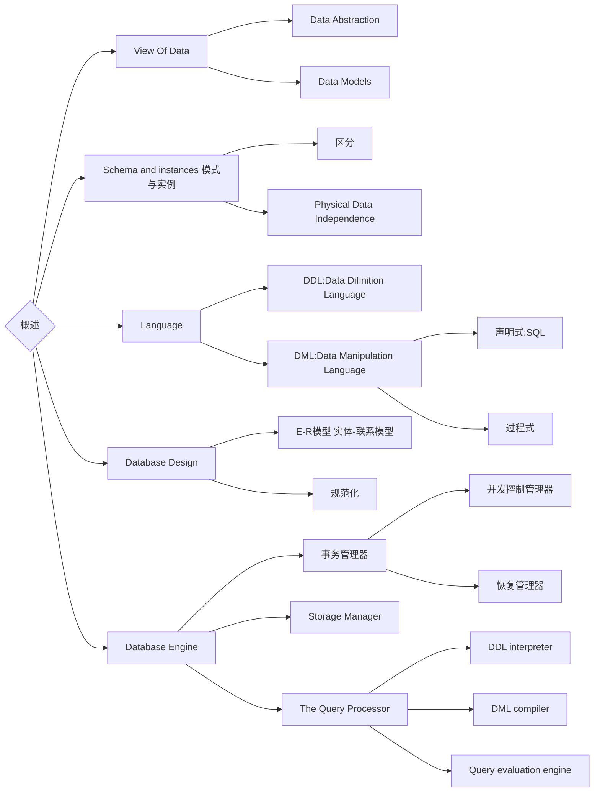

- **Database Management System (DBMS)**

> A **database** system is a collection of interrelated **data** and a set of **programs** that allow users to access and modify these data. 

**Characteristics of Databases**

​	data persistence (数据持久性)

​	convenience in accessing data (数据访问便利性)

​	data integrity (数据完整性)

​	concurrency control for multiple user (多用户并发控制)

​	failure recovery (故障恢复) 

​	security control (安全控制)

**file system的问题**

## View Of data

## Language

### DDL 

**Data dictionary**  contains metadata

- 数据模式
- 完整性约束
- 授权

### DML

**SQL**

- A query takes as **input several** **tables** (possibly only one) and always returns **a single table**.

- **SQL does not support** actions such as input from users, output to 

  displays, or communication over the network. 

