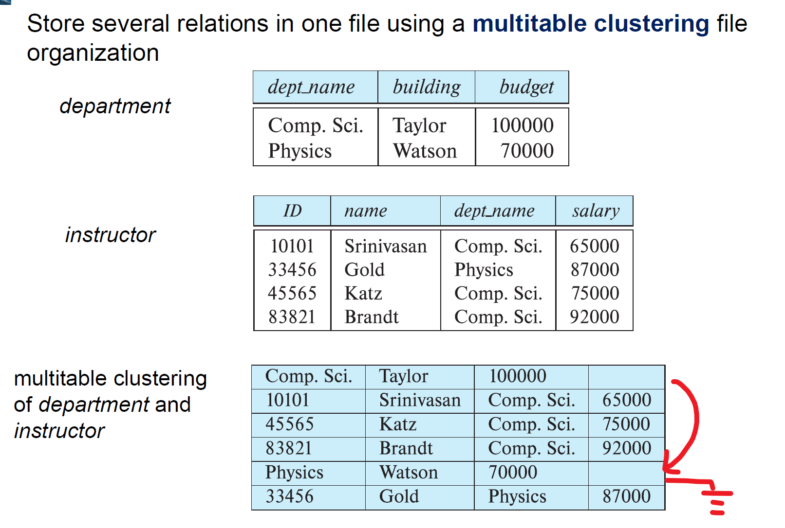
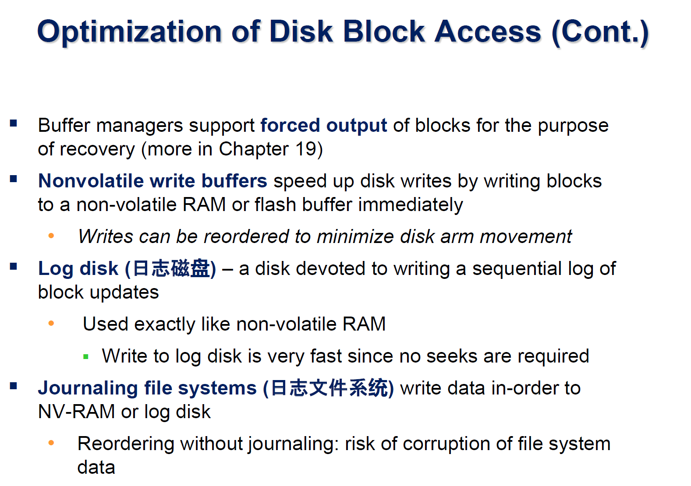

# Data Storage Structures

## File Organization

> Magnetic disks as well as SSDs are **block structured devices**, that is, **data are read or written in units of a block(数据传输和存储分配的基本单元，通常是4-8KB)**. In contrast, databases deal with **records**, which are usually **much smaller than a block** (although in some cases records may have attributes that are very large).

- The database is stored as **a collection of files**. 
- Each file is a **sequence of records**. 
- A record is a **sequence of fields.**

### Fixed Length Records

- use freelist
### Variable Length

**要解决的问题**

- 如何表示一个变长的属性？并且能够轻易地获取？
- 如何在Block中存储变长的record？

- id name dept_name salary(fixed length)
- 在部分表示方法中，Null Bitmap放在数据开头，并且只要置为1其数据部分就为空

**Slotted page （分槽页）**

### Organization of Records in Files

#### Heap

- Records usually **do not move once allocated**
- Important to be able to efficiently find free space within file

**Free-space map (自由空间图)**

- **Free space map** written to disk periodically, OK to have wrong (old) values for some entries (will be detected and fixed
#### Sequential File Organization

- **Search key** 排序的依据。可以是某个属性或者属性的集合，是否是超码、候补码不影响
- **Deletion** Using the pointer
- **Insertion** locate the position where the record is to be inserted
  - if there is free space insert there(这里是free_list，优先考虑free_list中的块，如果其中没有空余，那么再去overflow block插入)
  - if no free space, insert the record in an **overflow block (溢出块)**
  - In either case, pointer chain must be updated

- **Reorganize** 使之重新物理有序存储. 由于上面的溢出块模式，导致物理存储不一定按照指针顺序，进而降低访问效率

#### Multitable Clustering File Organization

- 对相同的信息聚类；把不同的关系放在同一个表中
- Results in variable size records
- Can add **pointer chains to link records** of a particular relation

- 把一个department的instructor聚集在一起

### Partitioning

## Data Dictionary Storage

- 有助于语义检查
- 使用`metadata`的想法

## Buffer

- **Blocks** are units of both storage allocation and data transfer 内存申请、数据传输
- **Buffer (缓冲区)** – portion of main memory available to store copies of disk blocks，但是在磁盘上的拷贝可能旧于缓冲区的
- **Buffer manager (缓冲区管理器)** – subsystem responsible for allocating buffer space in main memory.

**流程**

- System Call
  - in the buffer  Return
  - not in the buffer
    - buffer is full
      - The replaced block is updated -> write back to disk
      - not , deleted the replaced page, and replaced
    - buffer is not full
        - Read The Page and return 

**pinned Block**
> memory block that is not allowed to be written back to disk
- **Pin** done before reading/writing data from a block 在申请数据/写数据之前“Pin”
- **Unpin** done when read /write is complete
- **Multiple concurrent** pin/unpin operations possible
    - Keep a **pin count**, buffer block can be evicted only if pin count = 0

**Shared and exclusive locks on buffer | 共享锁和排他锁**
> Needed to prevent concurrent operations from reading page contents as they are moved/reorganized, and to **ensure only one move/reorganize at a time**

- 共享锁和排他锁不能并行
- 同一时间最多一个进程具有排他锁

### 缓冲区替换策略

#### LRU

> 从buffer中去掉最近最少用到的

!!! example "example"
	

对于要“扔掉”的数据，要判断是否已经修改过（buffer中的数据可能是数据库中的数据修改后的数据）。

​	

??? example "Clock: An approximation of LRU"
	[介绍](https://www.geeksforgeeks.org/lru-approximation-second-chance-algorithm/)

#### others
**Toss-immdiate 立即丢弃**

**Most recently used (MRU) strategy**

操作系统/缓存管理器可能会对写操作进行重新排序

Operating system or buffer manager may **reorder writes**

- Can lead to corruption of data structures on disk
    - E.g., linked list of blocks with missing block on disk	
    - File systems perform consistency check to detect such situations  或者可以使用下面介绍的日志

### 日志

## Column-Oriented Storage

> Store each attribute of a relation separately
>
> 

- 最简单的情况是每一种属性分文件存放  Further, each file is *compressed*, to reduce its size.

**优点**  Analysis Queries —— 可能访问很多rows，但是只取其中部分属性

- 提高CPU效率
- 减少I/O
- 减少Disk访问时间
- 向量访问方便
- 对于Decision Support更加高效

**缺点**

Traditional row-oriented representation preferable for transaction processing
