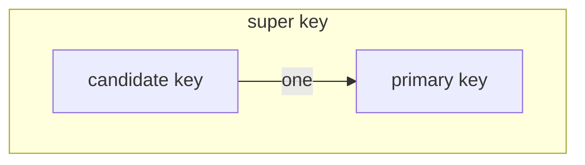
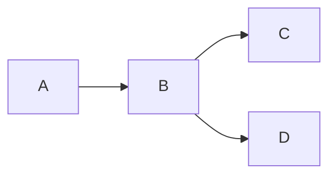

# Chapter 7 **Relational Database Design**

## Features of Good Relational Design

**不规范的关系模式**

> 同时也是要去decompose一个关系模式的原因

**函数依赖 | functional dependency**

- 无损连接的定义
  自然连接之后等于原组合

- 无损连接的分解

  分解 之后 至少有一个**公共属性**，**且是其中一个关系的` key`**(不是`primary`)
  
  这里是一个充分条件，而不是必要的：
  
  $证明的思路\\ R_1\cap R_2\to R_1 \\or \\ R_1\cap R_2\to R_2$​

- **lossy** **decomposition**

  > 原因在于name属性不是一个候补键，不能决定其他属性

- 可以根据自然连接后能否恢复来判断（有可能会变多/少）

## Functional Dependency

> 就是一种 constraint 

**Trivial case**

- 没有实际的信息存在
- 通常情况下，我们隐含这样的假设：这个函数依赖不是Trivial的（非平凡的）

### Closure | 闭包

#### 公理 | Armstrong`s Axioms

- **推论**

$$
1 \ \ \  \alpha \to \beta,\alpha\to\gamma \Rightarrow \alpha\to\alpha\beta,\alpha\beta\to\beta\gamma\Rightarrow\alpha\to\beta\gamma \\
2 \ \ \ apply\ tansitive\ law \\
3 \ \ \  apply\ tansitive\ law \\
$$

- **消去律**   消去某一边的公共属性

> Example
>
> 

#### 属性的闭包

- 就是某个属性A可以决定其他哪些属性，这些属性就是A的闭包

!!! info "uses"
	
	- 用于计算函数依赖 F 的闭包
	

#### **Canonical Cover | 正则覆盖**

- 化简，使得不存在多余的属性和函数依赖

- **Extraneous Attributes(无关属性)**

> Example
>
> 第一种方法往往是计算程序使用的，人工使用这种方法并不高效
>
> 
>
> 
>
> ??? example "example"
> 	

## **Boyce-**Codd **Normal Form**  |  BCNF

- 任何一条函数依赖要么是平凡的，要么左边是key  ==  任何一条非平凡的左边都是`super key`

!!! warning "Warning"
	不是指$\alpha\to\beta 中的\alpha$是key的一部分，而是它本身就可以决定其他所有

- **转换为BCNF**
  - 把违反定义的Func拿出来，保持无损去分解

??? example "example"
	

### How good is BCNF

- 是BCNF但是仍然存在问题 <= 存在多值依赖且还有其他属性
- 使用 4-NF， 见 [多值依赖](## Multivalued Dependencies)

## **Dependency Preservation**

**定义**

- 不需要在分解后的$R_i$之间建立新的关联（通过自然连接重新建立属性间的联系）就可以得到所有的`DF（Dependency Func）`

??? example "example"
	
	$(F_1 \cup F_2)^+ <>F^+$

??? example  "execise"
	
	
	- BCNF分解的时候不需要去管函数依赖的问题

## Third Normal Form

!!! info "定义"
	

**算法**

- 生成正则覆盖

- 对所有的函数依赖生成关系模式

- 检测是否有关系模式包含`candidate key`，**一定要注意自始至终没有在函数依赖中出现的属性！**

!!! example "example"
$$
schema(A,B,C,D,E,G)
\\A\to BCD
\\BC\to DE
\\B\to D
\\D\to A
\\G这个属性没有在上述函数依赖中出现
$$

> Q1 : 求BCNF
>
> 通过求A、BC、B、D的闭包，可以发现他们都相同(ABCDE)，这个时候一定不要想当然的认为他们满足BCNF的条件，**题中的FG是孤立的元素**
>
> $R_1=(A,B,C,D)\ left = AEG$
> 由于$A^+=ABCDE,所有这里有函数依赖A\to E成立$
> $R_2=(A,E),R_3=(A,G)$

## **Multivalued Dependencies**

**definition**

> 函数依赖是多值依赖的特殊形式

### 4 NF

- 平凡的多值依赖
- α是`super key`

!!! example "ER graph"
	

## Process

1. 设计ER Graph，由ER图转为关系模式，不需要再去normalize
2. 不设计，之后再去normalize

**引入冗余，保持性能**

