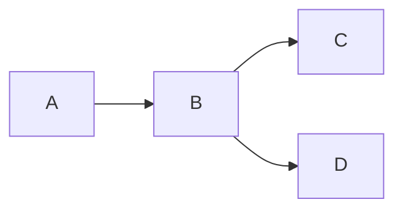

# Chapter 7 Relational Database Design

## Features of Good Relational Design

**不规范的关系模式**

**函数依赖 | functional dependency**

- 无损连接的分解
  分解 之后 至少有一个公共属性，**且是其中一个关系的` key`**(不是`primary`)

- **lossy** **decomposition**

- 可以根据自然连接后能否恢复来判断（有可能会变多/少）

## Functional Dependency

**Trivial case**

- 没有实际的信息存在
- 通常情况下，我们隐含这样的假设：这个函数依赖不是Trivial的（非平凡的）

### **Closure(闭包)** 

#### 公理 | Armstrong`s Axioms

> **Example**
>
> 

#### 推论

- **消去律**   消去某一边的公共属性

#### 属性的闭包

- 就是某个属性A可以决定其他哪些属性，这些属性就是A的闭包

**<u>Uses</u>**

#### **Canonical Cover（正则覆盖）**

- 化简，使得不存在多余的属性和函数依赖

> Example
>
> 第一种方法往往是计算程序使用的，人工使用这种方法并不高效
>
> 
>
> 
>
> ??? example "example"
>     

### Boyce-Codd Normal Form  |  BCNF

- 任何一条函数依赖要么是平凡的，要么左边是key  ==  任何一条非平凡的左边都是key

??? example "example"
    

### **Dependency Preservation**

**定义**

- 不需要在分解后的$R_i$之间建立新的关联（通过自然连接重新建立属性间的联系）就可以得到所有的`DF（Dependency Func）`

??? example "example"
    
    $(F_1 \cup F_2)^+ <>F^+$

??? example  "execise"
    

