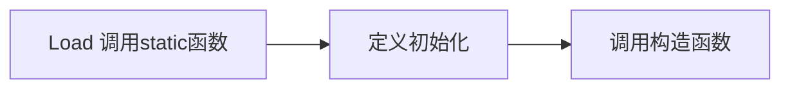

---
tags:
  - doing
  - class/JAVA
statistics: true
title: NOTE
author: zzicarus
date: <% tp.date.now("YYYY-MM-DD HH:mm:ss") %>
update: <% tp.date.now("YYYY-MM-DD HH:mm:ss") %>
---

>[!todo] 
>- [ ] 垃圾回收机制
>- [ ] 内存分布
>- [ ] 类
>	- [ ] 继承

# Java

>[!tip] 
>- 用 `jshell` 可以使用与 python 类似的交互

>[!info] 概念
>- SDK
>- JDK

## overview

- Compiled Language
- All objects should be constructed in runtime and be stored in heap.
- Every class in Java is a descendant of one class: Object
- Java 中的输入输出，Scanner 容易超时

```Java
//import java.util.*;  
import java.util.Scanner;  
public class Main {  
    public static void main(String[] args) {  
       Scanner sc = new Scanner(System.in);  
       int a = sc.nextInt();  
       System.out.println(a);  
    }  
}
```

- Java 中的保留字
- Identifier

>[!note] 和 C++ 不同的语言特性
>- Java 中的常量使用关键字 `final` 而不是 `const`. `final int a = 5;`
>- Java 中类型推导关键字为 `var`. `var s = new StringBuffer();`
>- Java 的 reference 更像是 C++中的指针，不可计算. 任何对象变量都是指针
>	- 
>	- 对象变量的赋值
>
>>[!example] 
>>将这里理解为类似指针，是操作权指向的赋予，不会像 C++ 一样做赋值
>>```Java
>>var a = new A(10);  
>>var b = new A(20);  
>>System.out.printf("%d %d\n", a.i, b.i);  
>>a = b;  
>>b.i = -20;  
>>System.out.printf("%d %d\n", a.i, b.i);
>>```
>
>- Auto Memory Management -- 单根结构
>- index check
>	- Primitive 可以存放在栈，对象全部都放在堆（heap 只能通过 `new` 获得）
>
>>[!note] Dynamic
>>- Java 中的一个文件只能含有一个 `public` 类，其名称与文件名称相同

>[!important] Java 的运行
>

### 内存布局

## String API

- 所有字符类型都是 unicode，就像下面的中文也会是一个字节

```Java title="对长度的判断"
String a = "hello你好";  // len = 7
String b = "hello";		// len = 5
```

- String 为不可变类型。

### Methods

**得到属性**
- `s.length () `
- `s.charAt (int index) `
**切片**
- `s.substring (int , int )`
- 
**比较**
- `s.compareTo ()`  
- `s.equals ()`
- `s.equalsIgnoreCase ()`
- `Boolean startsWith (String str)`
- `Boolean endsWith (String str)`
**变换**
- `String trim ()` 删除前导、后导空格
- `String replace (char c 1, char c 2)`
- `public String replaceAll(String regex, String replacement)` 可使用正则表达式进行替换。[[../../Tools/正则表达式|正则表达式]]
**与其他的值相互转化**

```JAVA
String piStr = "3.14159";
Float pi = Float.ValueOf (piStr);
Float pi 2 = Float.ParseFLOAT (piStr);
```

## Basic

**参数传递**
- Passing value
- 对象传递也是类似指针，无法阻止函数内部对对象的改变
**Relation**
- 整型的 wrapper 在[-128,127]之间是一个固定的对象

```Java
Integer n1 = new Integer(47);
Integer n2 = new Integer(47);
System.out.println(n1 == n2);  // false

Integer n3 = 47;  
Integer n4 = 47;
System.out.println(n3 == n4);  // true
```

### Package

### Class

>[!note] 
>- 类在内存中也是一个对象属于 Class
>- Java 会对 new 的对象的内存清空为 0
>- 定义初始化，在构造函数之前，初始化顺序与在 class 中定义的顺序相关

- 代理构造

  ```java

public Rectangle(int width, int length) {

	this.width = width;

	this.length = length;

}

public Rectangle() {

	this(0, 0);

}

  ```


```Java
Flower(String s, int petals) {
        this(petals);
        this.s = s; // Another use of "this"
        System.out.println("String & int args");
    }
```

- 静态

## 练习题

### Week 1

### Week 2

---

>[!question] 
>**Q 1**
>About access control in Java, which statement below is correct?
>
>A. A member without any access modifier is default to private
>
>B. A member without any access modifier is default to public
>
>C. A member without any access modifier is default to protected
>
>**D. Classes in the same package can access members without any access modifier.**

>[!note] 
>Java 中的访问权限是 public、protected、default 和 private。其中 default 具有包访问权

---

>[!question] 
>**Q 2**
>

### Week 3