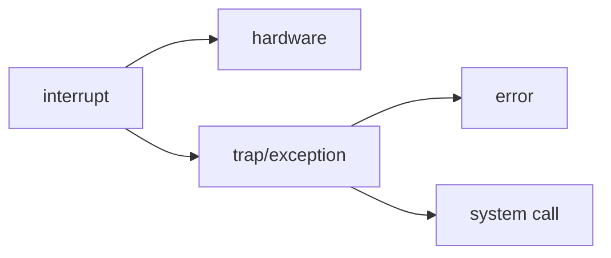

---
tags:
  - doing
  - class/OS
statistics: true
title: NOTE
author: zzicarus
date: <% tp.date.now("YYYY-MM-DD HH:mm:ss") %>
update: <% tp.date.now("YYYY-MM-DD HH:mm:ss") %>
---

# overview

>[!note] 什么是一个操作系统？
>
>kernel 是 一个不断运行着的、控制硬件的软件程序，kernel是OS中最重要的一个部分
>**职能**
>
>- Resource Allocator
>为上层的 App 分配底层资源
>- Control Program
>控制程序的运行，防止错误的发生

## Architecture

- Single Processor System
- Multiprocessor System
	- 单核  
	  多个 Processor 拥有各自的 local cache 但共享物理资源. 每一对 CPU 都执行所有的任务
	  
	- 多核
	  多核的优势在于耗能更低，一个芯片中数据交互更方便
	  
	- NUMA

## I/O

## Operation

### Multiprogram & Multitasks

前者偏向于改进系统效率方面，后者偏向于改进用户体验

**Multiprogram** 增强了 CPU 的利用效能

- A subset of total jobs in system is kept in memory
- 

**Multitasks** | Time sharing

>在同一时间内让多个任务（或进程）共享系统资源并同时运行的技术。尽管在单核CPU上，实际上每次只能执行一个任务，操作系统通过快速切换任务，让用户感觉多个任务在同时进行。

- Response Time 比较短，有利于交互
- 把 CPU 分为不同的 Time Slides，不断切换不同的进程

### Dual Modes

存在一个 Mode bit 来控制状态，0（内核态）1（用户模式）

- User Mode 发出 system call
- Privilege | Kernel | system | supervisor Mode

存在风险的指令为 `Privileged Instructions`，只能由内核模式执行。**中断只能运行在 kernel mode** 

**状态切换**

- 

### Timer

>一般包含一个 clock 和一个 counter，每次 clock tick 都会使 counter--，counter 等于 0 触发中断。
>在进入用户模式之前（before scheduling process），都会设置一个 Timer，防止陷入无限循环。

## Resource Management

操作系统为进程分配资源，如 CPU、 Memory、 Input Data 等等

### Process Management

>[!note] 什么是进程？
>一个单独的程序并不是一个进程，一个程序是静态的，是 passive entity。而进程要求是一个运行中的程序，active entity。
>
>进程具有 Isolation 的特点，一个进程爆了并不会影响另外一个

>[!tip] 进程和线程
>
>|特性|进程|线程|
>|---|---|---|
>|内存空间|独立分配|共享同一进程的内存空间|
>|资源占用|占用较多资源|占用资源少，切换成本低|
>|通信方式|需要通过IPC机制|共享内存，通信简单|
>|创建开销|创建和切换开销较大|创建和切换开销较小|
>|崩溃影响|一个进程崩溃不会影响其他进程|一个线程崩溃可能影响进程内其他线程|

- 一个进程下可以有多个线程
- 每一个线程都会有一个 Program Counter 指向下一个要执行的指令

### Memory Management

## Operating System Structures

### System Call

https://note.hobbitqia.cc/OS/chap01/#system-calls

### Operating System

## Linker And Loader

- 详细：[HabbitQia学长的Notes](https://note.hobbitqia.cc/OS/chap01/#running-a-binary-dynamically-linked)

## VM

## System boot

硬件如何确定操作系统的位置呢？这需要有一段代码可以定位内核的位置并把它放到 memory 中运行。这段代码就被称之为 **bootstrap program / bootstrap loader**. 通过加载内核来启动计算机的过程称之为 **booting** the system.

**Process**

1. **bootstrap program or boot loader** locates the kernel. 定位内核
2. The kernel is loaded into memory and started. 装载内核
3. The kernel initializes hardware. 初始化硬件
4. The root file system is mounted. 挂载根文件系统
`mount`： 将一个文件系统和一个存储设备关联起来

>[!quote] What is a `rootfs `?
>**The root filesystem is at the top of the hierarchical file tree** (also known as ‘/’). The Linux kernel directly mounts rootfs through the configuration argument ‘_root=_‘. The root filesystem also has mount points where we can mount other filesystems as well in order to connect them to this filesystem hierarchy. It has a number of directories containing files critical for booting the system and system operations.
>相较于其他文件系统，rootfs 的特殊之处就在于它是第一个被挂载的文件系统，且其被挂载之后，将启动一些默认的初始化程序。
>比如，在命令 ``

## 题目

Which of the following instructions should be privileged(in kernel mode)?

a. Set value of timer.

b. Read the clock.

c. Clear memory.

d. Issue a trap instruction.

e. Turn off interrupts.

f. Modify entries in device-status table.

g. Switch from user to kernel mode.

h. Access I/O device.