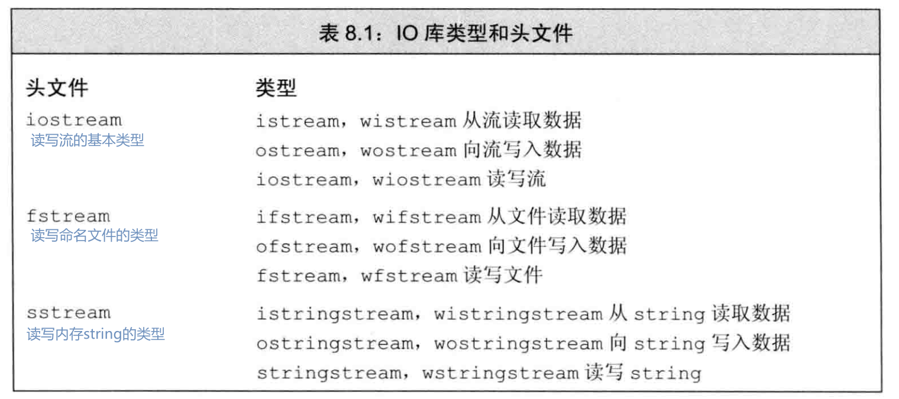
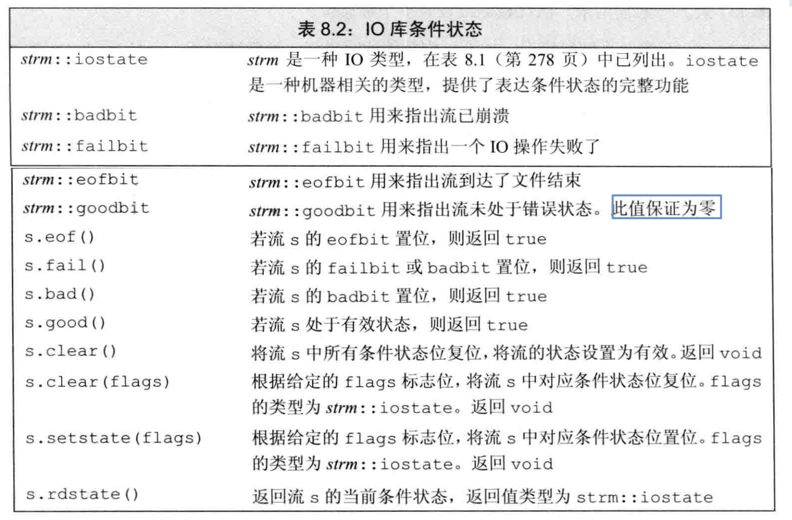
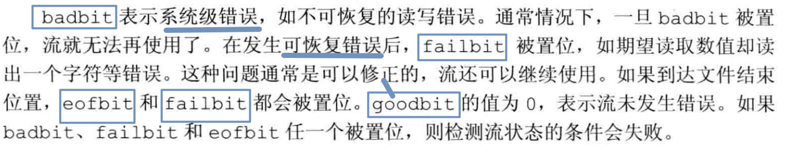
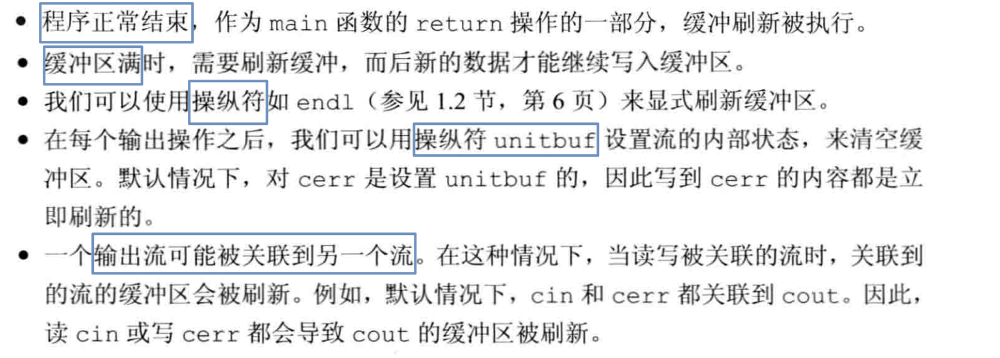
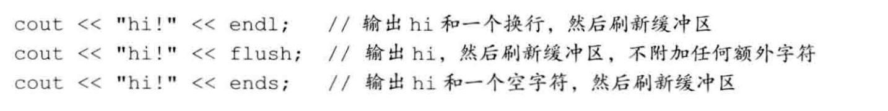
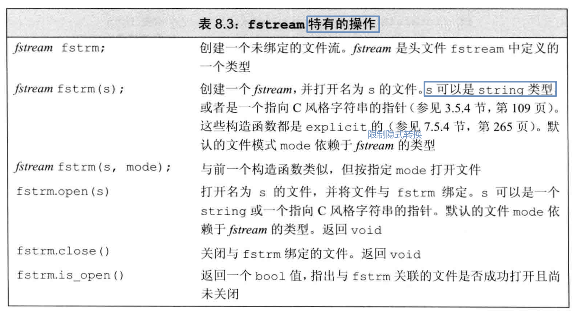
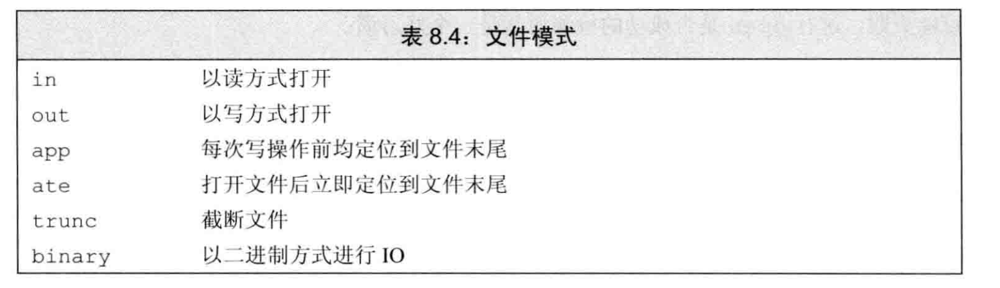
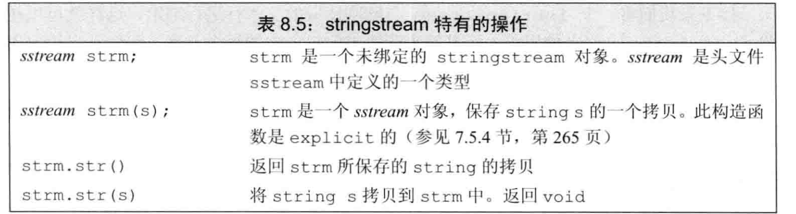

## IO类

- IO对象无赋值无拷贝


### 条件状态



#### 流的状态

`iostate`类型


- 可以利用`good() fail()`判断整体流的状态

!!! example "State Of I/O"
    ```cpp
    // cin会返回一个cin，并去检测stream是否做好了准备(Test)
    vector<int> read_ints(istream& is)
    {
    vector<int> res;
    int i;
    while (is>>i)
    res.push_back(i);
    return res;
    }

    //
    while (cin)
    {
        for (int i; cin >> i;)
        {
            // ... use the integer ...
        }
        if (cin.eof())
        {
            // .. all is well we reached the end-of-file ...
        }
        else if (cin.fail())
        {                // a potentially recoverable error
            cin.clear(); // reset the state to good()
            char ch;
            if (cin >> ch)
            { // look for nesting represented by { ... }
                switch (ch)
                {
                case '{':
                    // ... start nested structure ...
                    break;
                case '}':
                    // ... end nested structure ...
                    break;
                default:
                    cin.setstate(ios_base::failbit); // add fail() to cin’s state
                }
            }
        }
        // ...
    }
    ```
    

### 管理缓冲

!!! note "刷新缓冲的原因"
    
    <span class="box box-yellow">操纵符</span>

    
    ```Cpp
    cout << unitbuf;   // 所有cout操作之后都刷新buffer
    cout << nounitbuf;
    ```

**流的关联操作**

```c++
cin.tie(&cout);
// old_tie指向的是cin的关联流；转化后，cin不再关联
ostream *old_tie = cin.tie(nullptr);
cin.tie(&cerr);
cin.tie(old_tie);
```

## File



```cpp
ifstream in;   // read a file
ofstream out;  // writing a file
string filename("CppLearning");
in.open(filename + ".md");
if (in)
{ //...
}
in.close();
```

### 文件模式


"../Stadard_Library/关联容器.md"

!!! note "注意"
    以`out`方式打开文件，默认会覆盖
    ```cpp
    ofstream out("filename",mode);
    ofstream out("filename",ofstream::app | ofstream::out);

    ```

## String



!!! example "Example"
    使用`istringstream`读取，ostringstream输入
    使用`ostringstream`可以在适当的时机输出所有值
    ```c++ hl_lines="7 10 12" title="istringstream"
    string str, line;
    vector<PersonInfo> People;
    while (getline(cin, line))
    {
        PersonInfo Person;
        string name, numbers;
        istringstream iStr(line);
        iStr >> name;
        Person.name = name;
        while (iStr >> numbers)
        {
            Person.Phones.push_back(numbers);
        }
        People.push_back(Person);
    }
    // print
    for (auto person : People)
    {
        cout << "name:" << person.name << endl;
        cout << "phones:" << endl;
        for (auto phone : person.Phones)
            cout << phone << endl;
    }
    ```

`getline`

## User-defined

- `is.get(c)`函数不会跳过 Space

??? example "例程"
    ```cpp
    #include <iostream>
    #include <vector>
    #include <string>

    using namespace std;

    struct Entry
    {
        string name;
        int number;
    };

    ostream &operator<<(ostream &os, const Entry &e)
    {
        return os << "{\"" << e.name << "\", " << e.number << "}";
    }
    istream &operator>>(istream &is, Entry &e)
    // read { "name" , number } pair. Note: for matted with { " " , and }
    {
        char c, c2;
        if (is >> c && c == '{' && is >> c2 && c2 == '"')
        {                                 // star t with a { "
            string name;                  // the default value of a string is the empty string: ""
            while (is.get(c) && c != '"') // anything before a " is part of the name
                name += c;
            if (is >> c && c == ',')
            {
                int number = 0;
                if (is >> number >> c && c == '}')
                {                       // read the number and a }
                    e = {name, number}; // assign to the entry
                    return is;
                }
            }
        }
        return is;
    }

    int main()
    {
        Entry test;
        cin >> test;
        cout << test;
    }
    ```

## Formatting

> <ios>, <istream>,<ostream>, and <iomanip>

**精度控制**
```c++
constexpr double d = 123.456;
cout << d << "; " // use the default for mat for d
<< scientific << d << "; " // use 1.123e2 style for mat for d
<< hexfloat << d << "; " // use hexadecimal notation for d
<< fixed << d << "; " // use 123.456 style for mat for f
<< defaultfloat << d << '\n'; // use the default for mat for d

cout.percision(8);
cout << 1234.56789 << ' ' << 1234.56789 << ' ' << 123456 << '\n';

>>> 1234.5679 1234.5679 123456
```

**宽度控制**
