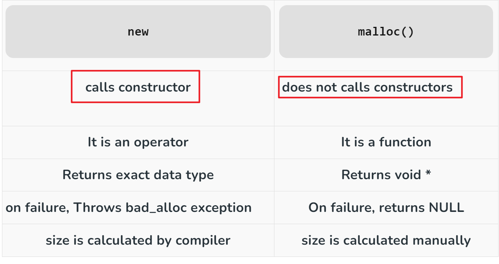
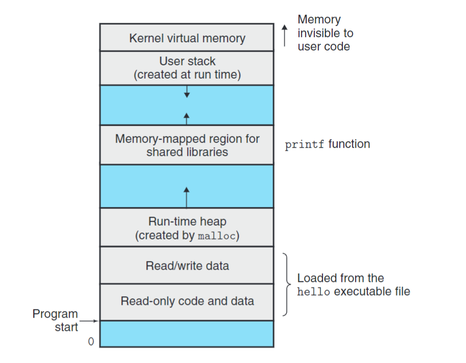
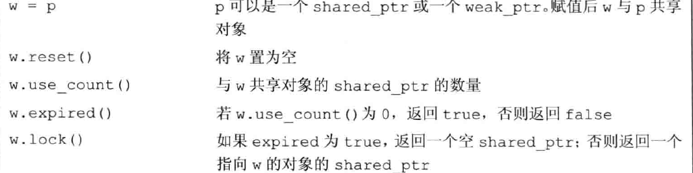

# 动态内存

!!! info "INFO"
    除了静态内存和栈内存，每个程序还会有一个内存池，用来存储在程序运行过程中创建的变量

    - 为什么使用动态内存？
        - 要使用的大小未知
        - 要使用的类型未知
        - 需要在多个程序间共享变量
            - 在某个作用域下定义一个动态指针，之后这个指针被销毁，但申请的内存还在

!!! question "The diffence between malloc and new"
    `delete` 和 `free` 几乎同理
    
    - 在内存中，new和delete申请的 Space 区域也不完全相同. new 位于 free store 区（也有说法是差别不大）
    


### delete

!!! warning "warning"
    使用动态内存的时候，一定要注意内存管理；使用delete的时候，一定要注意释放的是single var还是数组


```c++
delete single;
delete[] Array;
```


## 智能指针

> - `shared_ptr`
> `shared_ptr p = make_shared<typename>()`
>
> - `unique_ptr`
>
> - `weak_ptr`

### make_shared

!!! tip "TIPS"
    - 不使用多个智能指针指向同一个"底层的"(初始的)指针
        - 比如 p.get()返回的指针就是一个"底层的"
        - 或者reset
    - 如果使用智能指针管理的内存不是new来的，要给它一个删除器

**make_shared 函数**
```c++
auto a = make_shared<int>();
auto a = make_shared<int>(5);
```
**可选的 删除函数参数**

delete的时候调用析构函数，可以由user指定

`shared_ptr<> a(val,func)`

!!! note "shared_ptr"
    shared_ptr可以通过某种办法记录共享对象的指针（一个计数器），在count==0时，就会自动释放内存

    所以`shared_ptr` 支持`p.unique(),p.ues_count()`函数

    ```c++
    p.reset(q)  // 将p重新绑定到q

    // 改变底层对象之前，检测自己是否是唯一的
    if(!p.unique())
        p.reset(new string(*p));
    p.val = newVal;
    ```

### unique_ptr

!!! note "NOTES"
    一般情况下，unique_ptr不允许拷贝。

    但是在特殊情况下——编译器知道这里的unique_ptr将要被销毁。
    ```c++
    unique_ptr<int> clone(int p)
    {
        return unique_ptr<int>(new int(p));
    }
    unique_ptr<int> clone(int p)
    {
        rst = unique_ptr<int>(new int(p));
        return rst;
    }
    ```

### weak_ptr

> 指向 shared_ptr ，但并不增加其计数；销毁时同时销毁



```c++
weak_ptr<T> a;

```