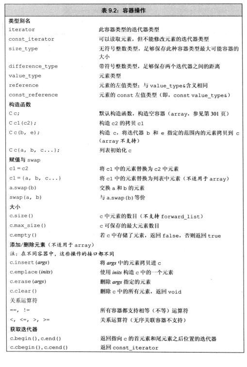

!!! abstract "Abstract"
    一个容器是一些特定类型对象的集合。
    所有容器类都共享公共的接口，不容的容器按照不同的方式进行拓展。<br>
    **一般情况下，范围 range(a,b) 指的是[a,b)**
    
- 类型
    

## 基本操作



### 定义 初始化

```Cpp
// 返回反向容器
reverse_iterator
const_reverse_iterator
c.rbegin() c.rend()
```

### 赋值与swap

```c++
c1 = c2;
c = {a,b,c};
swap(c1,c2);
c1.swap(c2);
seq.assign(b,e);   // b,e指向的不能是seq中的
seq.assign(initialList);
seq.assign(n,val);
```

> 除了数组之外，Swap操作不对数据进行拷贝、删除、插入，可以在常数时间内完成

## 顺序容器

### 操作

```c++
// 添加元素
c.push_back(t);
c.push_front(t);
c.emplace_front(args);
c.emplace_back(args);
    //返回第一个新加入元素的迭代器
c.insert(position,n,val);   // position 为 迭代器
c.insert(position,begin,end);
c.insert(position,initialList);

// 位置
c.at(n);
// 删除
c.pop_back();
c.pop_front();
c.erase(position);
c.erase(b,e);
// 改变大小
c.resize(n,optional::val);
// 容量大小
c.capacity();
c.size();
c.shrink_to_fit();
c.reserve(n);
```

!!! note "添加元素"
    - emplace与push、insert的不同在于，emplace是通过元素的构造函数直接构造一个新的元素；而另外两者是拷贝的方式

#### forward_list

```c++
flits.before_begin();
flits.insert_after(...);
emplace_after(iter_position,args);
flits.erase_after(position);
flits.erase_after(b,e);
```

#### String


```c++
// 构造函数
string s1(cp,n);  // cp[n]之前
string s2(str,pos);  // str[pos]之后
string s3(str,pos,len);
// 
s.substr(pos,n);  // position n个

// 插入 char / string
s.insert(nth,"");
s.append("");
s.replace();
```

!!! note "搜索操作"
    注意，**find()函数的返回值是 `unsigned` 类型**，string::size_type npos = -1;
    ```c++
    // 全匹配
    s.find();
    s.rfind();   // 最后一次出现
    // 部分匹配
    s.find_first_of();
    s.find_first_not_of();
    s.find_last_of();
    s.find_last_not_of();
    // example
    cout << a.find();   // Not Found: 18446744073709551615
    string str = "he is not here";
    cout << str.find("he") << endl;
    cout << str.substr(str.find("he"), sizeof("he"));
    // example 选择匹配
    string str = "11h23e55 i4456s88 n77o97t here!";
    string numbers("0123456789");
    string result("");
    string::size_type pos = 0;
    while ((pos = str.find_first_not_of(numbers, pos)) != string::npos)
    {
        result.push_back(str[pos]);
        pos++;
    }
    cout << result;
    ```

### 适配器 | adaptor

> 适配器可以将一个类的接口转化为另外一个类的接口。
> 通过包装一个底层的类，对其接口进行二次处理，呈现出一种新的形式
> 一般情况下，`stack` `queue`基于`dequeue`实现，`priority_queue`基于vector实现（**也可以通过重载改变**，但需要满足适配器的特性）
> 如 `stack<string, vector<string>> str_stk;`