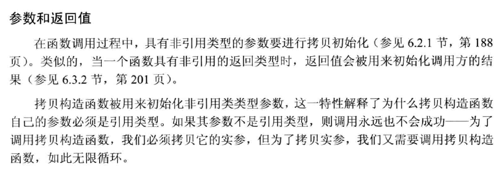

# Copy Control

```c++
class A
{
public:
    A(int i) : mi(i) {}
    A(const A &rhs) : mi(rhs.mi)
    {
        cout << "A::A(&)" << endl;
    }
    virtual void f()
    {
        cout << "A::f(), " << mi << endl;
    }
protected:
    int mi;
};
```

## 拷贝构造函数
```c++
A(const A &rhs) : mi(rhs.mi)
{

}
```



## 拷贝赋值运算

!!! note "拷贝"
    - 通常返回左值的引用
    - 