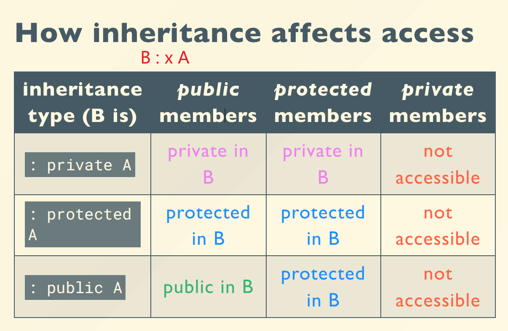

# 组合与继承

## 组合


## 继承



- 同名函数的继承问题
    一个派生类中override，其他基类同名函数也被覆盖掉

??? example "覆盖关系"
    ```c++
    #include <iostream>
    using namespace std;

    class A
    {
    public:
        A(int i) : mi(i) {}
        A(const A &rhs) : mi(rhs.mi)
        {
            cout << "A::A(&)" << endl;
        }
        A &operator=(const A &rhs)
        {
            mi = rhs.mi;
            cout << "A::operator=()" << endl;
            return *this;
        }
        virtual void f()
        {
            cout << "A::f(), " << mi << endl;
        }

    protected:
        int mi;
    };

    class B : public A
    {
    public:
        B(int i, int j) : A(i), mj(j) {}
        void f() override
        {
            cout << "B::f(), " << mi << ", " << mj << endl;
        }

    private:
        int mj;
    };

    int main()
    {
        A a1(1);
        B b(3, 4);

        A &ra = b;
        ra.f();
        ra = a1;
        ra.f();

        A a2 = b;
        a2.f();
    }
    ```