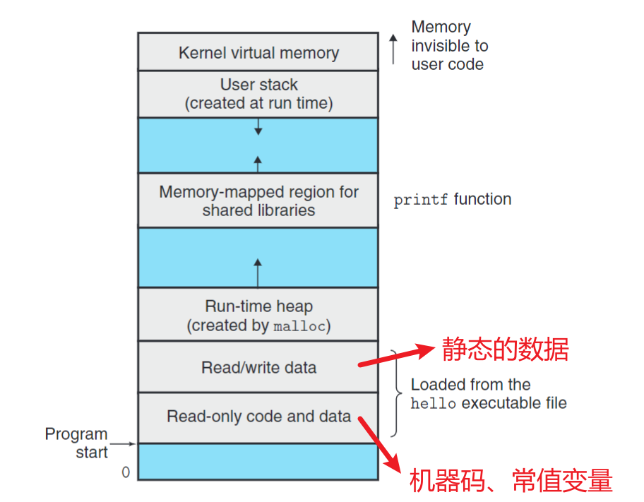
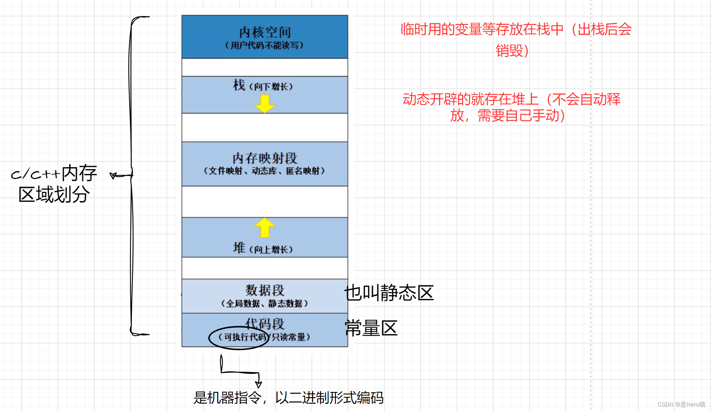

# 内存模型
!!! note "INFO"
    
## 




- stack 向下增长
    local vars
- heap  向上增长
dynamically
allocated vars.
- code/data
global vars
static global vars
static local vars

```c++
const char * s1 = ""      // 指向静态变量的指针  
char s2 [] = ""     // copy 一份 存储在栈区


const char *s1 = "Hello"; // 指向静态变量的指针
char *s3 = "Hello";
char s2[] = "Hello";

cout << (void *)main << endl;
cout << (void *)s1 << endl;
cout << (void *)s2 << endl;
cout << (void *)s3 << endl;
/*
0x40158f
0x404008
0x61fe0a
0x404008
*/
```