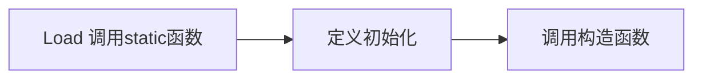

---
tags:
  - doing
  - class/JAVA
statistics: true
title: NOTE
author: zzicarus
date: <% tp.date.now("YYYY-MM-DD HH:mm:ss") %>
update: <% tp.date.now("YYYY-MM-DD HH:mm:ss") %>
---

>[!todo] 
>**Overview 部分**
>- [x] 垃圾回收机制
>- [x] 保留字
>- [ ] 内存分布
>- [ ] 访问权限符
>- [x] Package
>
>**类** 
>- [ ] 继承
>- [ ] 类内类的顺序

# Java

>[!tip] 
>- 用 `jshell` 可以使用与 python 类似的交互

>[!info] 概念
>- SDK
>- JDK
>	功能齐全的 Java 开发工具包。包含JRE和Java Development Tools
>- JVM
>	Java 虚拟机（Java Virtual Machine, JVM）是运行 Java 字节码的虚拟机。JVM 有针对不同系统的特定实现（Windows，Linux，macOS），目的是使用相同的字节码，它们都会给出相同的结果。字节码和不同系统的 JVM 实现是 Java 语言“一次编译，随处可以运行”的关键所在。
>- JRE 是运行已编译 Java 程序所需的环境，主要包含以下两个部分：
>	1. **JVM** : 也就是我们上面提到的 Java 虚拟机。
>	2. **Java 基础类库（Class Library）**：一组标准的类库，提供常用的功能和 API（如 I/O 操作、网络通信、数据结构等）。

## overview

- Compiled Language
- All objects should be constructed in runtime and be stored in heap.
- 单根结构（除了C++的所有OOP语言） Every class in Java is a descendant of one class: Object
- Java 中的输入输出，Scanner 容易超时

```Java
//import java.util.*;  
import java.util.Scanner;  
public class Main {  
    public static void main(String[] args) {  
       Scanner sc = new Scanner(System.in);  
       int a = sc.nextInt();  
       System.out.println(a);  
    }  
}
```

- Java 中的保留字
- Identifier

>[!note] 和 C++ 不同的语言特性
>
>- Java 中的常量使用关键字 `final` 而不是 `const`. `final int a = 5;`
>- Java 中类型推导关键字为 `var`. `var s = new StringBuffer();`
>- Java 的 reference 更像是 C++中的指针，不可计算. 任何对象变量都是指针
>	- 对象变量的赋值
>
>>[!example] 
>>将这里理解为类似指针，是操作权指向的赋予，不会像 C++ 一样做赋值
>>```Java
>>var a = new A(10);  
>>var b = new A(20);  
>>System.out.printf("%d %d\n", a.i, b.i);  
>>a = b;  
>>b.i = -20;  
>>System.out.printf("%d %d\n", a.i, b.i);
>>```
>
>- Auto Memory Management -- 单根结构
>- index check
>	- Primitive 可以存放在栈，对象全部都放在堆（heap 只能通过 `new` 获得）
>
>>[!note] Dynamic
>>- Java 中的一个文件只能含有一个 `public` 类，其名称与文件名称相同

>[!important] Java 的运行
>

### 内存布局

### Package

- Java 的 Package 依赖于目录
	- 之后的代码属于这个 package
	- 这部分代码必须放在一个名为 `<Package name>` 的文件夹中

```java	
package <Package name>
```

- 设置寻找 Package 的地址
	- 环境变量
	- 通过 `-cp` 指定寻找路径， ` java -cp java hello.Hello `

**Package的作用域**

包在 Java 的访问控制中起着重要作用，主要涉及以下访问修饰符：

- **public**：公共访问，任何类都可以访问。
- **protected**：受保护的访问，允许**同一包内的类和不同包中的子类**访问。
- **默认（包私有）**：如果不指定访问修饰符，默认为包私有，只有同一包内的类可以访问。
- **private**：私有访问，仅在同一类内可见

#### Static Import

```java
double r = Math.cos(Math.PI * theta); 
import static java.lang.Math.PI; 
import static java.lang.Math.*; 
double r = cos(PI * theta);
```

## String API

- 所有字符类型都是 unicode，就像下面的中文也会是一个字节

```Java title="对长度的判断"
String a = "hello你好";  // len = 7
String b = "hello";		// len = 5
```

- String 为不可变类型。

### Methods

**得到属性**
- `s.length () `
- `s.charAt (int index) `

**切片**

- `s.substring (int , int )`

**比较**

- `s.compareTo ()`  
- `s.equals ()`
- `s.equalsIgnoreCase ()`
- `Boolean startsWith (String str)`
- `Boolean endsWith (String str)`

**变换**

- `String trim ()` 删除前导、后导空格
- `String replace (char c 1, char c 2)` 替换
- `public String replaceAll(String regex, String replacement)` 可使用正则表达式进行替换。[[../../Tools/正则表达式|正则表达式]]
  **与其他的值相互转化**

```JAVA
String piStr = "3.14159";
Float pi = Float.ValueOf (piStr);
Float pi2 = Float.ParseFLOAT (piStr);
```

### 比较

- [深入理解Java字符串常量池 | 二哥的Java进阶之路 (javabetter.cn)](https://javabetter.cn/string/constant-pool.html#字符串常量池在内存中的什么位置呢)

```java
public static void main(String[] args) {
        String s = "abc";  // 指向字符串常量池
        String t = "abc";
        String u = new String("abc");   // new的时候一定会创建一个新的对象在heap
        System.out.println(s == t);
        System.out.println(s == u);
}
```

- 

```java
String str = "Person";
String str1 = new String("Person");
System.out.println(str == "Person");  // true
System.out.println(str1 == "Person"); // false
```


## Basic

**参数传递**
- Passing value
- 对象传递也是类似指针，无法阻止函数内部对对象的改变
**Relation**
- 整型的 wrapper 在[-128,127]之间是一个固定的对象

```Java
Integer n1 = new Integer(47);
Integer n2 = new Integer(47);
System.out.println(n1 == n2);  // false

Integer n3 = 47;  
Integer n4 = 47;
System.out.println(n3 == n4);  // true

Integer n1 = 147;// new Integer(47);
Integer n2 = 147;// new Integer(47);
System.out.println(n1 == n2);  // false
```

### 垃圾回收 GC

[深入理解 JVM 的垃圾回收机制 | 二哥的Java进阶之路 (javabetter.cn)](https://javabetter.cn/jvm/gc.html)

## Class

>[!note] 
>- 类在内存中也是一个对象属于 Class
>- Java 会对 new 的对象的内存清空为 0
>- 定义初始化，在构造函数之前，初始化顺序与在 class 中定义的顺序相关
>- 一个类的定义，可以继承一个父类的同时，再实现多个接口
>	`class MathTest extends Student implements BaseTest`
>	- 可以在`Student`类中实现一部分接口的函数，在`MathTest`中就无需实现这部分

### 代理构造

Java 的代理构造和调用父类的构造函数都要放在构造函数开始的位置。

```java
public Rectangle(int width, int length) {
	this.width = width;
	this.length = length;
}
public Rectangle() {
	this(0, 0);
}
```

### 初始化顺序

Static member is to be initialized in the **loading** of the class



- Java的初始化会在Heap上申请内存，把这一块内存初始化为空
	- 对于Primitive会赋初值如0

```Java
class Cupboard {
	static {
		System.out.println("Loading Cupboard");
	}
	{
		System.out.println("Loading Cupboard instance");
	}
	Cupboard() {
		System.out.println("Cupboard()");
		b3.f(1);
	}
}
```

**静态初始化**

```java
static { ... }
```

- 在类被装载的时候运行且只会执行一次
- 类的状态是运行时装载，所以可能一个类未被装载

**定义初始化**

```java
{ ... }
```

- 每次创建实例都会调用

**构造初始化**

```java
ClassName(){}
```

### 函数的绑定

>Case 2 Shape. Java

Java 默认为动态绑定，

- Static binding: call the function as the code
- Dynamic binding: call the function of the object

### override

### Final

### Abstract & Interface

**Abstract**

- 一个抽象类中可以没有 abstract 函数，但含有 abstract 函数一定要是抽象类

**Interface**

- All methods in interface are public.
- 不能拥有构造函数
- All data members in interface are **public static final**.
- `implements` `interface` 可以实现多个接口

```Java
interface Instrument5 {
    // Compile-time constant:
    int i = 5; // static & final
    // Cannot have method definitions:
    void play(); // Automatically public
    String what();
    void adjust();
}
```

- 它前面的修饰符只能是`abstract / public`

```java
abstract interface BaseTest
```


> [!NOTE]
>
> 接口引入了新的方法类型：`default` 方法、`static` 方法和 `private` 方法。这些方法让接口的使用更加灵活。
>
> - Java 8 引入的`default` 方法用于提供接口方法的默认实现，可以在实现类中被覆盖。这样就可以在不修改实现类的情况下向现有接口添加新功能，从而增强接口的扩展性和向后兼容性。
>
> ```java
> public interface MyInterface {
>     default void defaultMethod() {
>         System.out.println("This is a default method.");
>     }
> }
> ```
>
> - `static` 方法无法在实现类中被覆盖，只能通过接口名直接调用（ `MyInterface.staticMethod()`），类似于类中的静态方法。`static` 方法通常用于定义一些通用的、与接口相关的工具方法，一般很少用。
>
> ```
> public interface MyInterface {
>     static void staticMethod() {
>         System.out.println("This is a static method in the interface.");
>     }
> }
> ```
>
> ------
>
> - Java 9 允许在接口中使用 `private` 方法。`private`方法可以用于在接口内部共享代码，不对外暴露。
>
> ```java
> public interface MyInterface {
>     // default 方法
>     default void defaultMethod() {
>         commonMethod();
>     }
> 
>     // static 方法
>     static void staticMethod() {
>         commonMethod();
>     }
> 
>     // 私有静态方法，可以被 static 和 default 方法调用
>     private static void commonMethod() {
>         System.out.println("This is a private method used internally.");
>     }
> 
>       // 实例私有方法，只能被 default 方法调用。
>     private void instanceCommonMethod() {
>         System.out.println("This is a private instance method used internally.");
>     }
> }
> ```

### Enum 枚举类

- 也是类，相当于构建了匿名子类，不是像C一样的宏（会进行类型检查`int i = 1; i == ONE`报错）
	- `==` 和 `equals` 效果相同，是比较特殊的引用类型
		- `enum`类型的每个常量在JVM中只有一个唯一实例，所以可以直接用`==`比较
	
	- 无法通过`new`创建实例
	- `Suit.values()`直接遍历访问整个enum类的所有
	


```java
public enum Rank { DEUCE, THREE, FOUR, FIVE, SIX,
        SEVEN, EIGHT, NINE, TEN, JACK, QUEEN, KING, ACE }

public enum Suit { CLUBS, DIAMONDS, HEARTS, SPADES }
static {
    for (Suit suit : Suit.values())
        for (Rank rank : Rank.values())
            protoDeck.add(new Card(rank, suit));
}
```

- 可以存在同名的函数与变量

- 解决`switch case`的思路之一

- 枚举常量必须在字段和构造函数之前定义
	```java
	public enum Planet {
	    MERCURY(3.303e+23, 2.4397e6),
	    VENUS(4.869e+24, 6.0518e6),
	    EARTH(5.976e+24, 6.37814e6),
	    MARS(6.421e+23, 3.3972e6),
	    JUPITER(1.9e+27, 7.1492e7),
	    SATURN(5.688e+26, 6.0268e7),
	    URANUS(8.686e+25, 2.5559e7),
	    NEPTUNE(1.024e+26, 2.4746e7),
	    PLUTO(1.27e+22, 1.137e6);
	
	    private final double mass; // in kilograms
	    private final double radius; // in meters
	
	    Planet(double mass, double radius) {
	        this.mass = mass;
	        this.radius = radius;
	    }
	
	    public double mass() {
	        return mass;
	    }
	
	    public double radius() {
	        return radius;
	    }
	
	    // universal gravitational constant (m3 kg-1 s-2)
	    public static final double G = 6.67300E-11;
	
	    public double surfaceGravity() {
	        return G * mass / (radius * radius);
	    }
	
	    public double surfaceWeight(double otherMass) {
	        return otherMass * surfaceGravity();
	    }
	
	    public static void main(String[] args) {
	        double earthWeight = Double.parseDouble(args[0]);
	        double mass = earthWeight / EARTH.surfaceGravity();
	        for (Planet p : Planet.values())
	            System.out.printf("Your weight on %s is %f%n",
	                    p, p.surfaceWeight(mass));
	    }
	}
	```

	

## 继承与多态

```Java
class BoardGame extends Game {
    BoardGame(int i) {
        super(i);
        System.out.println("BoardGame constructor");
    }
}
```

- Java 没有 name hide 的问题，子类的一个函数 override 不会覆盖父类的同名函数

```Java

```

- 静态初始化的顺序问题
- Upcast

### 内部类

- 装载是分开做的，只有在使用的时候才会进行装载。
- 函数中的内部类
	- 会在前面加上数字编号以区分不同的函数中的类


#### 匿名类

- 构造匿名子类
	- 可以访问外部的内容 but ***Argument must be final to use inside anonymous inner class***
	- 闭包
		与它相关的本地变量不会被回收，（保存当时的外部环境）
	- 定义初始化块可以充当它的初始化函数

```java
// 函数中的匿名类
public Contents cont() {
    return new Contents() {
        private int i = 11;
        public int value() {
            return i;
        }
    }; // Semicolon required in this case
}
```

## Generic Containers | 泛型容器


### Array

```java
int [] a = new int[10];

for (var x: a){
    x += 1;   // 不会改变它的值，相当于使用值（尽管Array本身是指针）
}

int [] b = a; // 指针
b[0] = 16;    // a[0] = 16
```

- 对象的数组中放的实质是指针

```java
Value [] a = new Value[10];
for (var x: a) // 这里x为指针，通过x访问它的元素然后改变
```

### Collection

- Java没有实现重载，访问某个元素只能使用`get`不能使用`[]`

**共有操作**

- `add`
- `addAll(Collection)`
- `toArray`

#### List

`ArrayList<Content_Type>` 存储方式为Array

```java
```

- `add`一个类的对象，放的还是指针

```java
ArrayList<Value> list = new ArrayList<>;
...
Value v1 = list.get(0);
```


#### Set

### Map

### Generic

存放类型的变量 Class类的变量


**subtype**


**WildCards**

```java
void printCollection(Collection<?> c) { 
	for (Object e : c) { 
 		System.out.println(e); 
	}
}
// 限定shape子类
public void drawAll(List<? extends Shape> shapes) 
{ ... }
```

## Exception & IO

- `System.out.println(true ? Integer.valueOf(1) : Double.valueOf(2.0));`
	- 编程语言的格式对齐，一条表达语句的结果只能存在一种情况
- Java中`throw`的对象一定是`Throwable (the exception root class) object`

**匹配机制**

- 和C++相同，父类放在最后

**异常声明**

- 未处理的异常必须要声明`throws ...`
- 一个函数中存在异常
	- 调用的函数抛出异常
	- 自己抛出异常

**类型**


- Error 是编译时检查的错误

 **限制**

- When you override a method, you can throw only the exceptions that have been specified in 

	the base-class version of the method.

- Classs
	- 构造
		- 仍然存在C++资源泄露的问题（文件）
	- 非构造
- 对于多来源的类，子类的能抛出的异常是父类的交集（可能被当做任何一种类，is-a）

## **补充知识**

### 命名规范

[5 分钟编码，1 小时命名，笑 | 二哥的Java进阶之路 (javabetter.cn)](https://javabetter.cn/basic-extra-meal/java-naming.html#_06、方法-method)

### Java 正则表达式


#### Matcher类

[Matcher 类 - Dev.java - Java 中文 (java-lang.cn) ](https://dev.java-lang.cn/learn/regex/matchers/)

### 中文处理

## 练习题

### Week 1

### Week 2

---

>[!question] 
>**Q 1**
>About access control in Java, which statement below is correct?
>
>A. A member without any access modifier is default to private
>
>B. A member without any access modifier is default to public
>
>C. A member without any access modifier is default to protected
>
>**D. Classes in the same package can access members without any access modifier.**

>[!note] 
>Java 中的访问权限是 public、protected、default 和 private。其中 default 具有包访问权

---

>[!question] 
>**Q 2**
>

### Week 3 | Class

- What will happen if you try to compile and execute B’s `main()` method? (  )

	```Java
	class A {
	    int i;
	    A(int i) {    this.i = i * 2;    }
	}
	class B extends A {
	    public static void main(String[] args) {
	        B b = new B(2);
	    }
	    B(int x) {
	        System.out.println(x);
	    }
	}
	```

	D. This code will not compile

> [!note]
>
> class A中只有一个带参数的初始化函数，必须要显式调用！（如果删除则可以通过编译）

---

