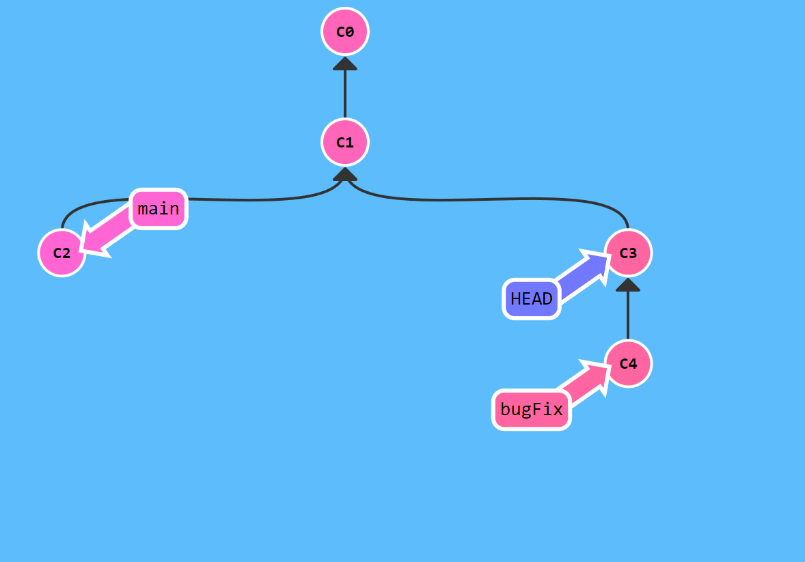
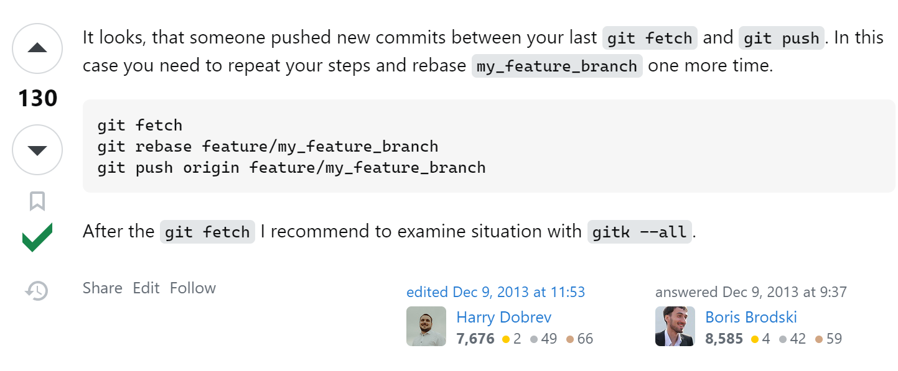

# Git

!!! info "Docs"
    - [Command 汇总](https://www.ruanyifeng.com/blog/2015/12/git-cheat-sheet.html)
    - [Learn Branch ：一个分支的练习\学习网站](https://learngitbranching.js.org/?locale=zh_CN)
## Usage

!!! note ""
    英文状态下按`q`可以退出`git log`等输出信息的命令

```
git init 

git add

git commit -m "message"

git status

git diff

git push origin main

git pull origin main

```

### 版本回退

HEAD表示最新版本，HEAD^,HEAD^^,HEAD~100表示前一个、前两个、前100个版本

`d16f1504a39840ea6962aa3e464a51bd8f72f298`是版本号，可以在`git log`命令中查看

如果在一次回退之后想要回到“未来”，使用`git relog`, 可以查看之前的命令

```shell
git reset --hard HEAD
git reset --hard d16f1504a39840ea6962aa3e464a51bd8f72f298
```

### 远程连接

!!! tip "SSH"
    

**关联远程库**
- origin 是当前的仓库名
`git remote add origin ...`

### 分支管理

!!! info "分离Head"
    分离的 HEAD 就是让其指向了某个具体的提交记录而不是分支名。

`git checkout HEAD`

```shell
git checkout -b dev  // 创建并跳转
# 创建 移动分支
git branch dev
git checkout dev
# 移动指定分支到指定位置
git branch -f main HEAD~3

git branch          // 查看当前分支

# 分支合并
git checkout main
git merge dev

# 删除分支
git branch -d dev

```

## Errors

### 冲突
[stockOverflow](https://stackoverflow.com/questions/20467179/git-push-rejected-non-fast-forward/20467414#20467414)



```shell
 ! [rejected]        main -> main (non-fast-forward)
error: failed to push some refs to 'github.com:zzicarus/zzicarus.github.io.git'   
hint: Updates were rejected because the tip of your current branch is behind      
hint: its remote counterpart. Integrate the remote changes (e.g.
hint: 'git pull ...') before pushing again.
hint: See the 'Note about fast-forwards' in 'git push --help' for details.  
```

### 分支

> 切换到新建的分支后，进行push报错

需要将本地新建的分支与远程的分支建立连接

方法1：`git push --set-upstream origin dev` 这里的dev是新的分支

方法2： 

```shell
fatal: The current branch dev has no upstream branch.
To push the current branch and set the remote as upstream, use

    git push --set-upstream origin dev

To have this happen automatically for branches without a tracking
upstream, see 'push.autoSetupRemote' in 'git help config'.
```