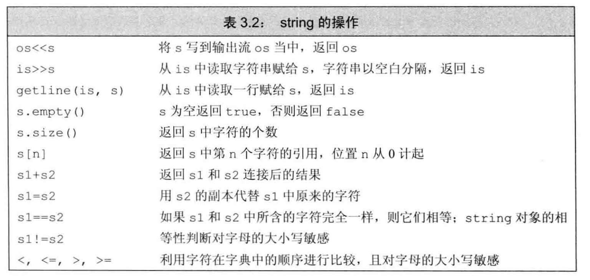

# 基础部分

## 基础

!!! note "一些注意的地方"
    - **赋值与初始化**其实并不完全相同，初始化是创建变量时赋予一个初始值，赋值是擦除当前值。
    - 一般情况下，这一点并没有任何影响

### 引用

!!! note "引用"
    这是C++中一种新的特性。我们常说的引用指的是左值引用，还有一种引用是指右值引用

#### 左值引用

定义左值引用的使用，一定要赋初始值

```CPP
int value;
int &refVal = value;
int *PtrValue = &value;
// 指向指针的引用
int *&refPointer = PtrValue;  
// 数组引用
int &arr[10];    // 元素为引用类型
int (&arr)[10];  // 整型数组的引用

```

对一个常量的引用可能是一个非常量,`const int &`只是对引用的操作有了限制

```CPP
int i = 10086;
const int m = i;
int &ref_i = i;
const int &Ref_i = i;
ref_i -= 1;
std::cout << "i:" << i << std::endl;
std::cout << "m:" << m << std::endl;   // 10086
std::cout << "i:" << ref_i << std::endl;  // 10085
std::cout << "I:" << Ref_i << std::endl;
```

!!! note "const 引用"
    ```CPP
    double a = 1.12;
    const double &ref_a = a;
    const int &Ref_a = a;
    a = a - 100;
    std::cout << "a:" << ref_a << std::endl;
    std::cout << "A:" << Ref_a << std::endl;

    >> a:-98.88
    >> A:1
    ```
    

!!! warning
    引用本身并不是一个对象，它`绑定`到一个对象上面去，这意味着它并`不是复制`
    不能够形成一个引用的引用


### 指针

!!! warning
    在CPP中，指针的初始化最好使用 `nullptr`,相当于void *，而NULL在`cstdlib`中定义，
    ```CPP
    int * a = nullptr;
    ```

### const
>
> const 分为顶层的和底层的。
> 顶层的 Top 表示本身不可变，指向的值不一定
> 底层的 表示本身可变，指向一个不可变的值
> 而指针既可以是Top-level，也可以是Low-level

#### const与指针

!!! example

    ```CPP
    int * const a = &i;  // 指针是常量  a顶层的，不能改变  
    const int * b = &j;  // 指向常量的指针
    ```
    其实上面的代码中，`a`是一个指针常量，`b`是一个常量指针；这样侧重后面的一个，可能容易理解一点
    ```CPP
    const char * a; //指向const对象的指针或者说指向常量的指针。
    char const * a; //同上
    char * const a; //指向类型对象的const指针。或者说常指针、const指针。 a是不可修改的左值
    const char * const a; //指向const对象的const指针。
    ```

#### constexpr和字面值类型

> 是一种常量表达式，C11加入作为一种类型
>
### 处理类型

#### 类型别名

```CPP
typedef double wage;
using wage = double; 
```

!!! warning "typedef"
    使用typedef时，以下两种用法可能带来不同的影响
    ```CPP
    typedef char *prtChar;
    const char*A = &ch;
    const prtChar B = &ch;
    // 这种情况下，B是一个指针；A是一个常量

    typedef char (*prtChar);
    const char *A = &ch;
    const prtChar B = &const_ch;
    // 这种情况下，A、B相同，都是一个指针类型的常量
    ```
!!! Question "为什么是这样定义的"
    Todo  Typedef的实际作用  是如何发生的

#### auto

<span class="box box-blue">C11</span>

> **auto的自动推断，会使得顶层的const失效，保留底层的const**

```CPP
int i = 0;
const int ci = i,&cr = ci;
auto b = ci; // b is int
auto c = cr;

```

#### decltype

<span class="box box-blue">C11</span>

> 有时候，我们只希望获得一个`Function`的最终运算类型，而不希望由它来赋予初始值

```CPP
int i;
decltype(f()) sum;
const int ci = 0, &cj = ci;
decltype(ci) a = 0; // const int 
decltype(cj) b = a; // const int &

decltype((i)) c;  //Error!! 引用必须赋予初始值
```

!!! note
    `decltype(())`的结果永远是引用
    `decltype()`则不然

## 字符串



### 基本操作

```CPP
// Initailize
string s;
string _10c(10,'c');
string _hi("hi");
string s = "value";
// Input
getline(input,receive);
// Method
s.size();   // unsigned int 
s.empty();
// 
string str1 = "World";
string str2 = "Hello";
string str3 = str2 + ", " + str1;
string str4 = "Hello" + " , " + str1; //false

```

!!! warning
    C++中的字符串的字面值类型并不是标准库string的对象。也就是说，字符串的字面值类型和string不是同一类型。

### cctype


```CPP title="for range"
for (auto c : str)
    cout << c << endl;

for (auto &c : str)
    c = toupper(c);
```

## Vector

!!! warning
    尽量减少使用数组和指针，尽量使用 Vector 和 iterator或者const_iterator
    尽量使用String而不是C风格的基于数组的字符串
    `string str = "ab"; char str[] = {'a','b','\0'}`

```CPP
// Initailize 
vector<int> v1(n, val);
vector<vector<int>> v2;
vector<string> v3;
string word;
# 可以使用数组来初始化Vector
int int_array[] = {0,1,2,3,4,5,6};
vector<int> vec(begin(int_array),end(int_array));
// Method
while (cin >> word)
    v3.push_back(word);
v3.pop_back();
// 返回的是 引用类型
v3.back();  v3.front();
// 返回迭代器
v3.begin();  v3.end();
v3.empty();
v3.size();
# 必须要指定清楚type
vector<int>::size_type;
# 在函数中返回一个Vector
vector<string> process()
{
    if(...)
        return {};
    else
        return {"Yes","No","CPP"};
}
```

```CPP
// 遍历 
    vector<string> a;
    a.push_back("begin");
    a.push_back("NO.1");
    *a.begin() = "change";
    for (auto ch : a[0])
        cout << ch;
    cout << endl;
    cout << "2 : " << a[1];
// Insert
    position = vector.begin();  // 是一个iterator类型
    vector.insert(position,number,val);
// Erase
    vector.erase(position);
    vector.erase(position_begin,position_end);

```

## 迭代器

!!! note
    begin end

    返回值类型可能是 iterator或者
    
    const_iterator
    
    cbegin cend
    
    一定是const_iterator

## 数组

```CPP
size_t cnt = 0;
constexpr size_t rowCnt = 3, colCnt = 4;
int Arr[rowCnt][colCnt];
for(auto &Row : Arr)   // note!
    for(auto Col : Row)
    {

    }
```

## 表达式

### 类型转换

!!! info
    - **隐式类型转换**
    - **显式类型转换**
    - **整型提升**
    - **无符号类型转换**
    

#### 强制类型转换

`cast-name<type>(expression)`

##### static_cast

> 只要不包含底层的const就可以使用

```CPP
double m;
void *p = &m;
double *dp = static_cast<double *>(p);
```

##### const_cast

> 只能改变底层const

##### reinterpret_cast

> 为转换对象的位模式提供更低层次的重新解释

### 运算符

!!! info "概念"
    - **重载运算符**
    - **左值和右值**

#### 优先级的问题


## 异常处理

!!! info
    - 异常检测
        - `throw 表达式`
    - 异常处理
        - `try block`
        - `异常类`


```CPP
// throw
    if(ISBN1 != ISBN2)
        throw runtime_error("Data ...");
// try
    try {
        // if throw one exception 
        // then, go for the related catch to deal with it 
    } catch(runtime_error err){
        cout << err.what();
    } catch(){

    }
```


## 函数

### 可变参数传递

!!! note ""
    === "initializer_list"
        > **形参数量未知，但类型相同**

        ```CPP
        initializer_list<int> lst{1, 2, 3};
        lst.size();
        lst.begin();
        lst.end();

        void error_msg(int type, initializer_list<string> il)
        {
            for (auto j : il)
                cout << j;
            cout << endl;
        }
        string a = "NO";
        error_msg(0, {"Yes", " or ", a});
        ```

    === "自定义可变模板"

    === "省略符号形参"
        > 便于C++访问部分特殊的C代码设置的。特别的是，大多数类类型的对象在传递给省略符形参时都无法正常拷贝。
        ```CPP
        void func(int a,...);
        void func(...);
        ```

### 返回值


**尾置返回类型**
`auto func(int i) -> int (*)[10]`

a

### 函数重载

### 函数匹配

### 函数指针
